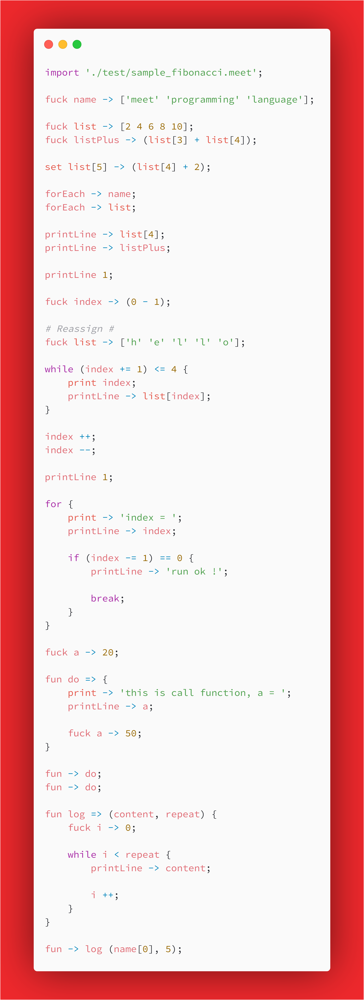

<div align='center'>
    
</div>

## Meet Programming Language

This is a interpreter, it took me two days to write this project, just for fun ! 

This repo is writing by golang, The JavaScript version is here: [meet-lang-node](https://github.com/Turaiiao/meet-lang-node)

You can see the summary here: [Turaiiao's Blog](https://blog.xyiio.cn/2019/02/15/2019-02-15/)

### Run

The first way, You can run meet. exe or set it to an environment variable, Linux version can run meet binary files directly

Any terminal input meet to open meet REPL.

```
# then, you can open the command window anywhere and run the `meet` command to enter REPL interface
> meet

# run the specified code file
> meet sample.meet

> meet -token sample.meet   # run and show code tokens.
> meet -ast sample.meet     # run and show code ast tree.
> meet -all sample.meet     # run and show tokens and ast tree.
> meet -env sample.meet     # run and show variable map environment.
> meet -more                # show more about meet #
```

Linux:

```
./meet [-token / -ast / -env / -all / -more] sample.meet
```

REPL:

```
Meet Programming Language REPL v 0.1.6 - Turaiiao 2019 - Email: 1171840237@qq.com
> fuck a -> 20;
> fuck b -> 'Hello World';
> fuck c -> (2 - 10);
> fuck d -> [1 2 3 4 5 6];
> fuck e -> d[2];
> printLine -> a;
20
> printLine -> b;
Hello World
> printLine -> c;
-8
> forEach -> d;
1 2 3 4 5 6
> printLine -> e;
3
```

### Comment

Use `#`, must one-to-one correspondence.

```
fuck a -> 20;
# fuck b -> 50; # # Not execute #
```

### Fuck Identifier

```
fuck a -> 20;
fuck b -> 'Hello World';
fuck c -> (20 + 20);        # with expression #
fuck d -> [1 2 3 4 5 6];
fuck e -> d[2];
```

It defines variables to variable tables.

### Print to screen

```
fuck a -> [2 4 6 8 10];
print -> 666;                       # print but no line feed #
printLine -> 888;                   # print and line feed #
printLine;                          # individual print line feed #
printLine -> 'Hello World';
print 3;                            # print 3 ' ' #
printLine 3;                        # print 3 '\n' #

forEach -> a;

printLine -> a[3];

Output:
666888

Hello World


2 4 6 8 10
8
```

### List

lists must be of the same type, it can now be integers and strings, use `forEach` identifier to print all element.

```
fuck name -> ['meet' 'programming' 'language' '!'];

fuck list -> [2 4 6 8 10];
fuck listPlus -> (list[3] + list[4]);

fuck a -> name[0];

forEach -> list;    # meet programming language ! #
forEach -> name;    # 2 4 6 8 10 #

printLine -> a;
printLine -> list[4];   # 10 #
printLine -> listPlus;  # 18 #

fuck a -> 0;

printLine -> list[a];

Output:
2 4 6 8 10 
meet programming language ! 
meet
10
18
2
```

### Conditional statement

```
fuck a -> 20;
fuck b -> 50;

if a == b {
    printLine -> 'Equal';
}

if a > b {
    print -> 'max is a, ';
} else {
    print -> 'max is b, ';
}

if (a += 30) == b {
    printLine -> 'oh, plus 30 to equal b.';
}

Output:
max is b, oh, plus 30 to equal b.
```

### Loop statement
```
fuck tom -> 0;
fuck frank -> 50;

while (tom += 1) < frank {
    if (tom % 2) == 0 {
        printLine -> tom;
    }
}

Output:
2
4
6
8
10
12
14
16
18
20
22
24
26
28
30
32
34
36
38
40
42
44
46
48
```

### Infinite Loop

Use a for block to terminate the loop with a break statement.

```
fuck a -> 0;

for {
    printLine -> a;

    if (a += 1) == 10 {
        printLine -> 'run ok !';
        
        break;
    }
}

Output:
0
1
2
3
4
5
6
7
8
9
run ok !
```

### Function

function is interesting structural grammar, use `fun` identifier and `=>` char to define a function, use `fun` identifier and `->` char to call it.

```
fuck a -> 20;

fun do => {
    print -> 'this is call function, a = ';
    printLine -> a;

    fuck a -> 50;
}

fun -> do;
fun -> do;

Output:
this is call function, a = 20
this is call function, a = 50
```

### Magic Identifier

```
fuck a -> 0;
fuck b -> [1 2 3 4 5];

a --;
a --;

printLine -> a;

a ++;
a ++;
a ++;
a ++;

printLine -> a;

forEach -> b;

set b[0] -> 5;

forEach -> b;

Output:
-2
2
1 2 3 4 5
5 2 3 4 5
```

Just For Fun !

```
MIT License

Copyright (c) 2019 Xyiio Turaiiao

Permission is hereby granted, free of charge, to any person obtaining a copy
of this software and associated documentation files (the "Software"), to deal
in the Software without restriction, including without limitation the rights
to use, copy, modify, merge, publish, distribute, sublicense, and/or sell
copies of the Software, and to permit persons to whom the Software is
furnished to do so, subject to the following conditions:

The above copyright notice and this permission notice shall be included in all
copies or substantial portions of the Software.

THE SOFTWARE IS PROVIDED "AS IS", WITHOUT WARRANTY OF ANY KIND, EXPRESS OR
IMPLIED, INCLUDING BUT NOT LIMITED TO THE WARRANTIES OF MERCHANTABILITY,
FITNESS FOR A PARTICULAR PURPOSE AND NONINFRINGEMENT. IN NO EVENT SHALL THE
AUTHORS OR COPYRIGHT HOLDERS BE LIABLE FOR ANY CLAIM, DAMAGES OR OTHER
LIABILITY, WHETHER IN AN ACTION OF CONTRACT, TORT OR OTHERWISE, ARISING FROM,
OUT OF OR IN CONNECTION WITH THE SOFTWARE OR THE USE OR OTHER DEALINGS IN THE
SOFTWARE.

```